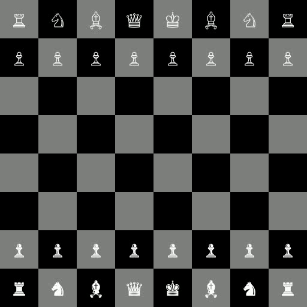
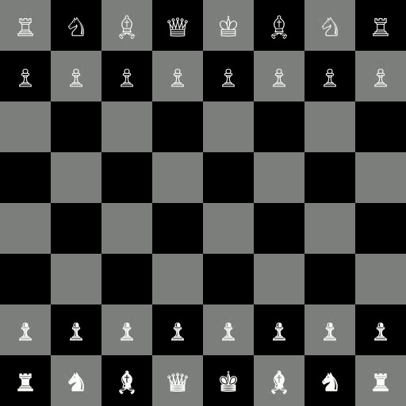
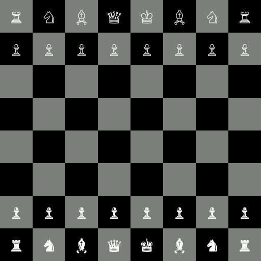
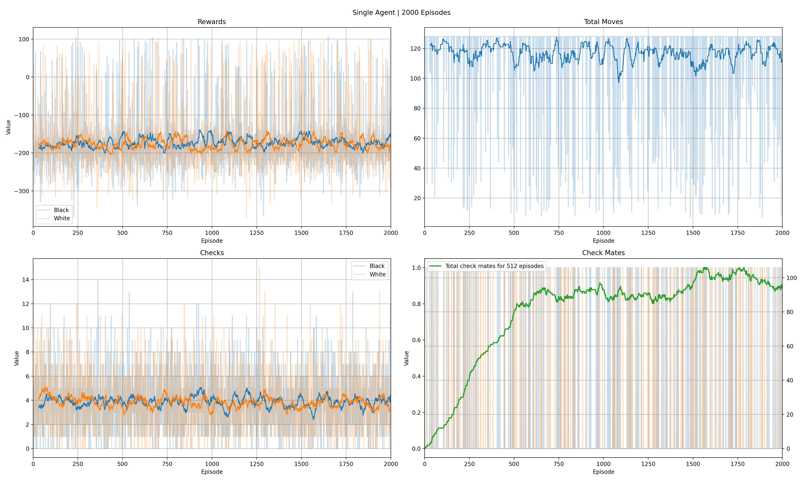
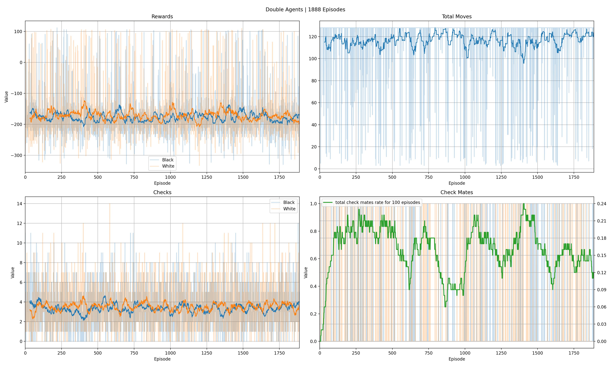

# Simple Multi Agent Deep Reinforcement Learning Chess


[](https://zenodo.org/badge/latestdoi/614358049)

The goal of this project is to build an environment for the game of chess and apply the Proximal Policy Optimization (PPO) algorithm to solve it using different methods. The chess environment implemented in this project will not support the en passant and castling moves.

The project will explore two different methods for applying the PPO algorithm to the chess environment. The first method will involve training two different agents with separate neural networks. These two agents will compete against each other, with each agent learning from the other's moves. This approach is known as self-play and has been shown to be effective in training game-playing agents.

The second method will involve training a single agent with a single neural network. This agent will learn to play both sides of the chessboard, meaning it will learn to play as both white and black pieces. This approach is known as joint training and has the advantage of being more computationally efficient since it only requires one agent to be trained.

| Initial Agent                             | Single Agent                             | Double Agents                             |
| ----------------------------------------- | ---------------------------------------- | ----------------------------------------- |
|  |  |  |

## 💾 Installation

```bash
git clone git@github.com:mhyrzt/Simple-MADRL-Chess.git
cd Simple-MADRL-Chess
python3 -m pip install requirements.txt
```

## 🏋️ Train

- you can either run default train.py file:

```bash
python3 train.py
```

- or you can create your own file:

```python
from chess import Chess
from agents import SingleAgentChess, DoubleAgentsChess
from learnings.ppo import PPO

if __name__ == "__main__":
    chess = Chess(
        window_size=512, 
        max_steps=128, 
        render_mode="rgb_array"
        # in case if you want to save episodes make sure the value is "rgb_array"
    )
    chess.reset()
    
    buffer_size = 16 # Number of Episode to store
    ppo = PPO(
        chess,
        epochs=100,
        batch_size=256,
        buffer_size=buffer_size * 2,
        hidden_layers=(2048,) * 4,
    )
    
    print(ppo.device)
    print(ppo)
    print("-" * 64)

    # also you can use `DoubleAgentChess` with the same parameters
    agent = SingleAgentChess( 
        env=chess,
        learner=ppo,
        episodes=40, # number of episodes to play/learn
        train_on=buffer_size, # current episode % train on == 0 then train
        result_folder="results",
    )
    agent.train(
        render_each=10, # render and save the game into a episode_{n}.mp4 file
        save_on_learn=True # save the stats after each learning
    )
    agent.save()
    chess.close()

```

## 📊 Results

After training your agent/agents, you can easily plot and view the results by running the following command:

```bash
python3 plot.py
```

### 👨‍🦯 Single Agent



### ⚔ Double Agents



## 🤝 Contributing

Contributions to this project are welcome. If you have any ideas or suggestions, feel free to open an issue or submit a pull request.

## 🔑 License

- This project is licensed under the MIT License. See the [LICENSE](LICENSE) file for details.
- Please note that ChatGPT, was only used to create the README.md file for this project. All other code and contributions were made solely by me and other contributors. ツ

## 📚 References

- [Proximal Policy Optimization Algorithms](https://arxiv.org/abs/1707.06347)
- [Action Space Shaping in Deep Reinforcement Learning](https://arxiv.org/abs/2004.00980)
- [Implementing action mask in proximal policy optimization (PPO) algorithm](https://www.sciencedirect.com/science/article/pii/S2405959520300746?via%3Dihub)
- [Reward is Enough](deepmind.com/publications/reward-is-enough)
- [Mastering Chess and Shogi by Self-Play with a General Reinforcement Learning Algorithm](https://arxiv.org/abs/1712.01815)

## ⚠️ Warnings

- Please note that the chess environment implemented in this project may have some bugs, particularly in the check and checkmate situations. While the environment has been designed to simulate the game of chess as accurately as possible, there may be some corner cases that have not been fully tested. We recommend using caution when interpreting the results of the agent's performance, particularly in situations where check and checkmate occur. We encourage users to report any issues they encounter to help improve the quality of the environment.

## 🗣️ Citation

```tex
@misc{mahyar_riazati_2023_7789509,
  author       = {Mahyar Riazati},
  title        = {{Simple Multi Agent Deep Reinforcement Learning 
                   Solution for Chess}},
  month        = mar,
  year         = 2023,
  publisher    = {Zenodo},
  version      = {1.0.0},
  doi          = {10.5281/zenodo.7789509},
  url          = {https://doi.org/10.5281/zenodo.7789509}
}
```
